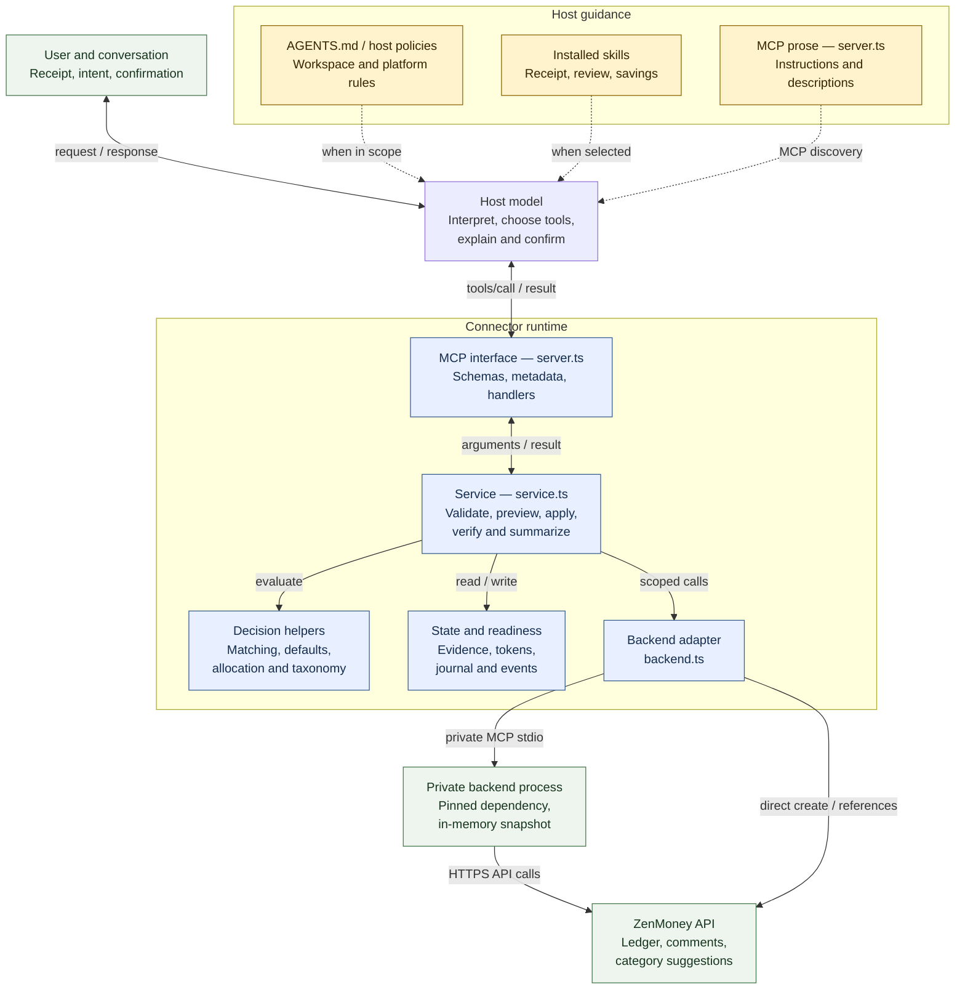
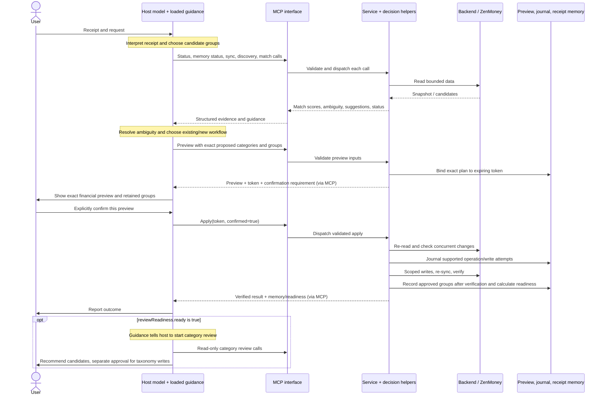

# Where behavior comes from

The host model decides what to say and which tool to call next. Skills, MCP instructions, user requests, and host policies inform that decision. The MCP server contains deterministic matching, defaults, validation, storage, and write orchestration. It does not run its own language model or execute a skill.

This view is for maintainers tracing a visible behavior to the place that owns it. It describes the repository's current implementation, including `F-019` storage guidance; it does not prove that a particular host loaded or followed that guidance. Parent links: VS-02 / C-04 development continuity, VS-03 / C-05 onboarding, and `F-020` in the [roadmap](../project/ROADMAP.md).

## Components and interfaces

Question: which parts guide decisions, and which parts execute or enforce them? This is a C4 component view of the connector with its host and external dependencies included for context. The hosted authentication wrapper is summarized in the deployment table below.

Dashed arrows carry guidance; solid arrows carry requests, results, or code calls. Yellow boxes contain instructions/context; blue boxes execute code. Neither color implies instruction priority: the host controls instruction loading, precedence, tool approval UI, and model choice. Arrow direction does not imply autonomous execution: every public tool operation starts with a caller.

The important split inside `server.ts` is **prose versus code**. `SERVER_INSTRUCTIONS` is passed to the MCP server during initialization. Tool descriptions and safety annotations explain the interface to clients. Zod input schemas and registered handlers execute when a tool is called. Editing a sentence changes guidance; changing a schema or service method changes what the server accepts or does. An annotation such as `readOnlyHint` is metadata, not the implementation of read-only behavior.

The service also returns `guidance`, `ambiguous`, `suggestedFields`, `requiresConfirmation`, and `reviewReadiness` fields. Those results are another source of model behavior. A host may be reacting to returned guidance even if no skill is loaded.

Source boundaries: [MCP interface and instructions](../../src/server.ts), [service](../../src/service.ts), [backend adapter](../../src/backend.ts), and [receipt extraction contract](../reference/receipt-extraction-contract.md). The private child imports the pinned dependency through [backend-entry.ts](../../src/backend-entry.ts); its generic internal tools are not exposed as public connector tools.

The [plugin manifest](../../.codex-plugin/plugin.json) points to the bundled skills and MCP configuration. Packaging and installation make these surfaces discoverable; they do not add another decision engine. Repository docs influence a model only when loaded into its context. The local [CLI](../../src/cli.ts) is another caller: its memory commands invoke the memory controller directly, without a host model or skill deciding the sequence.

## A receipt through the decision layers

Question: who chooses, who confirms, and what happens automatically inside one call? This dynamic view shows a successful receipt apply with memory enabled and valid evidence groups. Matching or validation failures return to the host before the write path; a disabled/unavailable memory store does not turn a verified financial operation into a failure.

The server validates `confirmed: true` and binds an apply to the previewed plan. It does not see the conversation or independently prove that the human approved it. Showing the preview and obtaining real consent remain host responsibilities. See [preview tokens](../../src/preview-token.ts), [operation preview store](../../src/operation-preview-store.ts), and [service apply methods](../../src/service.ts).

Readiness is similarly shared: [receipt-memory-store.ts](../../src/receipt-memory-store.ts) calculates the three-distinct-receipt threshold; the [receipt skill](../../skills/categorize-zenmoney-receipts/SKILL.md), [review skill](../../skills/review-zenmoney-categories/SKILL.md), and MCP instructions tell the host to perform the review. There is no background review scheduler or automatic taxonomy write.

## Find the owner of a behavior

| Observed behavior or question | Decision owner | Inspect or change here |
| --- | --- | --- |
| Receipt text was misread, or line items were grouped oddly | Host model, influenced by extraction guidance and user context | [Receipt skill](../../skills/categorize-zenmoney-receipts/SKILL.md), [extraction contract](../reference/receipt-extraction-contract.md); inspect the host's structured tool arguments. The server never sees the original image/PDF. |
| Why did it choose this category or purpose label? | Host interpretation; optionally upstream suggestions | Receipt/review skills and current context. `suggestCategories` in [service.ts](../../src/service.ts) calls the upstream transaction-suggestion API and filters to active categories. It is a candidate source, not final authorization. |
| Why does it reject `Groceries` as an evidence purpose? | Executable validation plus broader host guidance | `isKnownBroadPurpose`, `validPurpose`, and `validateReceiptEvidenceGroups` in [receipt-memory-store.ts](../../src/receipt-memory-store.ts). The code rejects a finite broad-label set and invalid syntax; it cannot establish every label's semantic correctness or detect every product name. |
| Why did it ask me to identify a matching transaction? | Code scores candidates; host decides how to clarify | `rankReceiptMatches` in [receipt.ts](../../src/receipt.ts), `matchReceipt` in [service.ts](../../src/service.ts), then receipt skill/MCP guidance. No candidate also returns `ambiguous: true`; the host must distinguish an empty result from competing matches when choosing the next workflow. |
| Why did it suggest today's date or this account? | Server-side deterministic defaults, when host omits those inputs | [receipt-defaults.ts](../../src/receipt-defaults.ts) and `previewNewReceipt` in [service.ts](../../src/service.ts). “Host-local today” is the MCP process's clock/timezone; hosted mode may differ from the user's device. |
| Why did it ask too many questions or skip a review? | Host orchestration and loaded guidance | `SERVER_INSTRUCTIONS`, tool-result `guidance` in [service.ts](../../src/service.ts), and the relevant installed skill. Check what this session actually loaded before editing code. |
| Why did it request confirmation? What prevents stale writes? | Host obtains consent; schemas/service/token stores enforce the call contract | [server.ts](../../src/server.ts), [service.ts](../../src/service.ts), [preview-token.ts](../../src/preview-token.ts), [operation-preview-store.ts](../../src/operation-preview-store.ts). Human approval itself cannot be inferred from the boolean alone. |
| Why is an amount, account, category, or allocation rejected? | Executable domain rules | [service.ts](../../src/service.ts), [receipt-operations.ts](../../src/receipt-operations.ts), [taxonomy-operations.ts](../../src/taxonomy-operations.ts), and MCP schemas. Prompt wording cannot override these checks. |
| Why is category consolidation blocked? | Complete-reference rules and API capability limits | [category-consolidation.ts](../../src/category-consolidation.ts), service consolidation methods, [backend.ts](../../src/backend.ts); source budgets block apply. See `F-016B`. |
| Why did review begin after three receipts? | Store calculates readiness; host starts the review | `reviewReadiness` in [receipt-memory-store.ts](../../src/receipt-memory-store.ts), receipt/review skills, and MCP instructions. Changing the numeric threshold requires code; changing the follow-up conversation requires guidance. |
| Why are spending totals separate, or the period 90 days / three months? | Totals: service; default analysis period and recommendations: host guidance | `categorySummary` / `spendingInsights` in [service.ts](../../src/service.ts); [review](../../skills/review-zenmoney-categories/SKILL.md) and [savings](../../skills/find-zenmoney-savings/SKILL.md) skills. Tool inputs require explicit dates. |
| Why did it explain locality or suggest a remote comment? | `F-019` guidance | `SERVER_INSTRUCTIONS`, receipt/review skills, [AGENTS.md](../../AGENTS.md), and [memory guide](../how-to/manage-receipt-memory.md). This does not install a filesystem write blocker or automatic remote sync. |
| Where is evidence actually stored, and why did it expire? | Store defaults/configuration and retention code | [receipt-memory-store.ts](../../src/receipt-memory-store.ts), [receipt-memory.ts](../../src/receipt-memory.ts), hosted tenant factory in [hosted-server.ts](../../src/hosted-server.ts). Ask memory status for the actual location; do not infer it from the checkout. |
| Why can't it edit an existing comment? | Public tool surface and preserved-field rules | [server.ts](../../src/server.ts) has no existing-comment edit tool; [service.ts](../../src/service.ts) preserves existing comments. New-receipt `comment` is optional and repeated on every created part. Its exact text must be shown alongside the preview by the host. |
| Why does an interrupted write require inspection instead of retry? | Journal/recovery implementation plus host retry guidance | [operation-journal.ts](../../src/operation-journal.ts), service recovery/compensation methods, and MCP instructions. Preview tokens are ephemeral; durable operation records support classification after restart. |
| Why is a tool missing, or an edit not taking effect? | Installation, running build, host discovery, or deployment mode | [installer](../../scripts/install.mjs), [skill refresh](../../scripts/install-skills.sh), [local entrypoint](../../src/index.ts), [hosted server](../../src/hosted-server.ts), and the client's cached tool list. Hosted-only OAuth tools need the hosted wrapper. |

## Runtime and storage boundaries

| Boundary | Local mode | Hosted mode |
| --- | --- | --- |
| Host-to-connector interface | MCP over stdio, [index.ts](../../src/index.ts) | MCP Streamable HTTP at `/mcp`, [hosted-server.ts](../../src/hosted-server.ts) |
| Before domain logic runs | Local process access and host tool policies | Bearer validation, tenant-bound session, then the same `createServer` and service; see [hosted-auth.ts](../../src/hosted-auth.ts) |
| Skills and workspace instructions | Loaded by the host if installed/selected/in scope | Not transferred by an HTTP MCP connection; remote hosts receive MCP instructions and tool metadata, and may have their own guidance |
| ZenMoney credentials | Environment/OS credential resolver, outside model context | Separate per-tenant ZenMoney OAuth lifecycle and encrypted credential store; MCP-client login and ZenMoney authorization are distinct |
| Receipt evidence, operation journal, events | Private application data on the MCP machine | Tenant-separated server disk; optional PostgreSQL covers encrypted OAuth envelopes/states, not receipt memory |
| Transaction comments | Remote ZenMoney data | Remote ZenMoney data; separate from connector evidence retention/deletion |
| Preview state | In-process; expired/lost tokens need fresh previews | In-process per service/session; not portable across restart or another session |

The host has its own conversation, attachment, and retention behavior; this connector cannot promise those are local. “Receipt bytes stay with the host” means they do not enter this MCP server, not that the host model runs on the user's laptop. The [hosted architecture](hosted-architecture.md) describes the additional authentication/deployment boundaries; hosted source exists, but deployment and live OAuth remain externally gated.

## Trace a surprising result

Follow the boundary where the behavior first appeared:

1. **Before a tool call:** inspect user context, loaded skill, MCP instructions, and the host's interpretation. A correction in chat is not automatically a repository rule or persistent preference. [Local preferences](../reference/self-awareness.md#explicit-local-preferences) require their own exact confirmed lifecycle; inspect enabled effective values before attributing a decision to them.
2. **In tool arguments:** the host selected those values. Missing date/account fields deliberately invoke server defaults; supplied values bypass that suggestion step.
3. **In a tool result:** find the tool in [server.ts](../../src/server.ts), follow its handler into [service.ts](../../src/service.ts), then inspect the helper or backend call. Check structured flags and limits as well as prose `guidance`.
4. **After the result:** compare the model's explanation/action with the actual returned data. A `ready` flag does not itself run another tool, and a preview does not write to ZenMoney.
5. **Only in a new or old session:** compare the running build and installed skill copies. Editing `src/` needs a build and MCP restart; editing bundled skills needs the documented [refresh and new-session workflow](../how-to/develop.md). `AGENTS.md` applies when loaded in the repository; it is not automatically shipped through MCP.

For a read-only interface inventory, use `node dist/cli.js schema` after building. It constructs the local tool catalog without a live backend and includes descriptions, input schemas, and annotations. It does not report which skills a host loaded, its effective instruction precedence, or the separate initialization instructions.

Validate at the owning layer: host/model evaluation for receipt interpretation and conversational adherence; [MCP contract tests](../../tests/mcp-contract.test.ts) for the exposed surface; domain/store tests for deterministic rules; separately authorized live checks for external API behavior. The [synthetic receipt evaluation](../reference/receipt-extraction-contract.md#regression-pack) tests the structured-facts contract, not real OCR accuracy.
